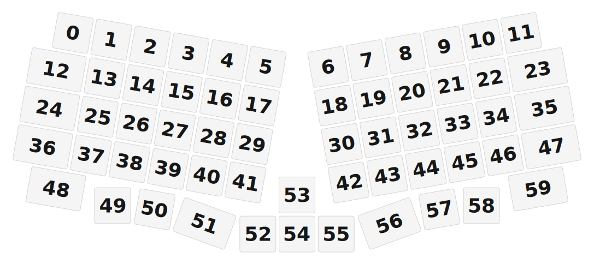

# ZMK Configuration for Nami Parallel

*Generated by Shield Wizard for ZMK*



Download compiled firmware from the Actions tab. <https://zmk.dev/docs/user-setup#installing-the-firmware>

Edit your keymap <https://zmk.dev/docs/keymaps>.
User keymap is located at [`config/nami_parallel.keymap`](config/nami_parallel.keymap).

-----

<details>
<summary>
Shield Wizard Debug Information
</summary>

In case of broken configuration, here is the Shield Wizard internal data used to generate this configuration:

Commit: 8a52249f61161469b6d90ed8c80c4aa52b9f3858

```json
{"name":"Nami Parallel","shield":"nami_parallel","dongle":false,"modules":[],"layout":[{"id":"01KJFXA88QAPJSNEVWRY4VM2Q5","part":0,"row":0,"col":0,"w":1,"h":1,"x":0.863,"y":0.079,"r":10,"rx":1.363,"ry":0.579},{"id":"01KJFXA88QY83SS1S3G45JBSW2","part":0,"row":0,"col":1,"w":1,"h":1,"x":1.873,"y":0.257,"r":10,"rx":2.373,"ry":0.757},{"id":"01KJFXA88QYX69SS363PPPKBMP","part":0,"row":0,"col":2,"w":1,"h":1,"x":2.884,"y":0.436,"r":10,"rx":3.384,"ry":0.936},{"id":"01KJFXA88QY7WD80QFNPGM58GB","part":0,"row":0,"col":3,"w":1,"h":1,"x":3.895,"y":0.614,"r":10,"rx":4.395,"ry":1.114},{"id":"01KJFXA88QDB9N8M4Q0X2EEBGV","part":0,"row":0,"col":4,"w":1,"h":1,"x":4.906,"y":0.792,"r":10,"rx":5.406,"ry":1.292},{"id":"01KJFXA88QV5NH3G8629T81Q39","part":0,"row":0,"col":5,"w":1,"h":1,"x":5.916,"y":0.97,"r":10,"rx":6.416,"ry":1.47},{"id":"01KJFXA88QHJD1T5ZNAZ75VT04","part":0,"row":0,"col":6,"w":1,"h":1,"x":7.554,"y":0.97,"r":-10,"rx":8.054,"ry":1.47},{"id":"01KJFXA88QS8CT1HBT44B7BQ6Q","part":0,"row":0,"col":7,"w":1,"h":1,"x":8.565,"y":0.792,"r":-10,"rx":9.065,"ry":1.292},{"id":"01KJFXA88QB6KQ8691JFF05BF2","part":0,"row":0,"col":8,"w":1,"h":1,"x":9.575,"y":0.614,"r":-10,"rx":10.075,"ry":1.114},{"id":"01KJFXA88QNC8CBRQV8BFA21GC","part":0,"row":0,"col":9,"w":1,"h":1,"x":10.586,"y":0.436,"r":-10,"rx":11.086,"ry":0.936},{"id":"01KJFXA88Q75PB32J6P1Y0VYGB","part":0,"row":0,"col":10,"w":1,"h":1,"x":11.597,"y":0.257,"r":-10,"rx":12.097,"ry":0.757},{"id":"01KJFXA88Q25HXC37XM8V340SV","part":0,"row":0,"col":11,"w":1,"h":1,"x":12.607,"y":0.079,"r":-10,"rx":13.107,"ry":0.579},{"id":"01KJFXA88QKC9P5D6GDRF62F9J","part":0,"row":1,"col":0,"w":1.5,"h":1,"x":0.186,"y":1.046,"r":10,"rx":0.936,"ry":1.546},{"id":"01KJFXA88QPKDTWBH0763747NA","part":0,"row":1,"col":1,"w":1,"h":1,"x":1.695,"y":1.268,"r":10,"rx":2.195,"ry":1.768},{"id":"01KJFXA88Q3JWBSRA6NEQKHGH5","part":0,"row":1,"col":2,"w":1,"h":1,"x":2.706,"y":1.446,"r":10,"rx":3.206,"ry":1.946},{"id":"01KJFXA88QDWGZ4ATFSY2H46M0","part":0,"row":1,"col":3,"w":1,"h":1,"x":3.717,"y":1.625,"r":10,"rx":4.217,"ry":2.125},{"id":"01KJFXA88QF13452QPV4BZJX69","part":0,"row":1,"col":4,"w":1,"h":1,"x":4.727,"y":1.803,"r":10,"rx":5.227,"ry":2.303},{"id":"01KJFXA88QPDSS5VBZKYS7QXRX","part":0,"row":1,"col":5,"w":1,"h":1,"x":5.738,"y":1.981,"r":10,"rx":6.238,"ry":2.481},{"id":"01KJFXA88QXE4GQQJDHAPQK2C1","part":0,"row":1,"col":6,"w":1,"h":1,"x":7.732,"y":1.981,"r":-10,"rx":8.232,"ry":2.481},{"id":"01KJFXA88QEHMRTSTQ4451BSEV","part":0,"row":1,"col":7,"w":1,"h":1,"x":8.743,"y":1.803,"r":-10,"rx":9.243,"ry":2.303},{"id":"01KJFXA88QP4JSEWWYEB9BM1RD","part":0,"row":1,"col":8,"w":1,"h":1,"x":9.753,"y":1.625,"r":-10,"rx":10.253,"ry":2.125},{"id":"01KJFXA88Q6MZZ9NWWKFVRN2PB","part":0,"row":1,"col":9,"w":1,"h":1,"x":10.764,"y":1.446,"r":-10,"rx":11.264,"ry":1.946},{"id":"01KJFXA88Q880Q9HF9B233J1MZ","part":0,"row":1,"col":10,"w":1,"h":1,"x":11.775,"y":1.268,"r":-10,"rx":12.275,"ry":1.768},{"id":"01KJFXA88QAV982YRDFCDS52JR","part":0,"row":1,"col":11,"w":1.5,"h":1,"x":12.784,"y":1.046,"r":-10,"rx":13.534,"ry":1.546},{"id":"01KJFXA88Q5HNC5CFC818AYJK3","part":0,"row":2,"col":0,"w":1.5,"h":1,"x":0.007,"y":2.057,"r":10,"rx":0.757,"ry":2.557},{"id":"01KJFXA88R0KF408BH4WBN90ZV","part":0,"row":2,"col":1,"w":1,"h":1,"x":1.517,"y":2.279,"r":10,"rx":2.017,"ry":2.779},{"id":"01KJFXA88R3DVBFH67G9BXNCGV","part":0,"row":2,"col":2,"w":1,"h":1,"x":2.528,"y":2.457,"r":10,"rx":3.028,"ry":2.957},{"id":"01KJFXA88RY76M2B66BV1Q61Z8","part":0,"row":2,"col":3,"w":1,"h":1,"x":3.538,"y":2.635,"r":10,"rx":4.038,"ry":3.135},{"id":"01KJFXA88RGZ5NTK0SJSY78PQH","part":0,"row":2,"col":4,"w":1,"h":1,"x":4.549,"y":2.814,"r":10,"rx":5.049,"ry":3.314},{"id":"01KJFXA88RAN2T0E1RJKPGREBT","part":0,"row":2,"col":5,"w":1,"h":1,"x":5.56,"y":2.992,"r":10,"rx":6.06,"ry":3.492},{"id":"01KJFXA88RPHG0CSGCZ5F4M56F","part":0,"row":2,"col":6,"w":1,"h":1,"x":7.91,"y":2.992,"r":-10,"rx":8.41,"ry":3.492},{"id":"01KJFXA88RN88WCQX2KXREPD6G","part":0,"row":2,"col":7,"w":1,"h":1,"x":8.921,"y":2.814,"r":-10,"rx":9.421,"ry":3.314},{"id":"01KJFXA88RSRNAPPP2RFGPE3G3","part":0,"row":2,"col":8,"w":1,"h":1,"x":9.932,"y":2.635,"r":-10,"rx":10.432,"ry":3.135},{"id":"01KJFXA88RT0D2ZG9QDE9X5VBM","part":0,"row":2,"col":9,"w":1,"h":1,"x":10.942,"y":2.457,"r":-10,"rx":11.442,"ry":2.957},{"id":"01KJFXA88RWR9T7X8YS84KZTN9","part":0,"row":2,"col":10,"w":1,"h":1,"x":11.953,"y":2.279,"r":-10,"rx":12.453,"ry":2.779},{"id":"01KJFXA88R1GXYS1V0RF60B1G1","part":0,"row":2,"col":11,"w":1.5,"h":1,"x":12.963,"y":2.057,"r":-10,"rx":13.713,"ry":2.557},{"id":"01KJFXA88RRXT29V10EDY5A5M0","part":0,"row":3,"col":0,"w":1.5,"h":1,"x":-0.171,"y":3.068,"r":10,"rx":0.579,"ry":3.568},{"id":"01KJFXA88RWT821VQT23XBSPC3","part":0,"row":3,"col":1,"w":1,"h":1,"x":1.339,"y":3.29,"r":10,"rx":1.839,"ry":3.79},{"id":"01KJFXA88R0G202BG9NSEB0Q6V","part":0,"row":3,"col":2,"w":1,"h":1,"x":2.349,"y":3.468,"r":10,"rx":2.849,"ry":3.968},{"id":"01KJFXA88RXYY7JVTD44NVAC3B","part":0,"row":3,"col":3,"w":1,"h":1,"x":3.36,"y":3.646,"r":10,"rx":3.86,"ry":4.146},{"id":"01KJFXA88RT3VXE3A885WEX82T","part":0,"row":3,"col":4,"w":1,"h":1,"x":4.371,"y":3.824,"r":10,"rx":4.871,"ry":4.324},{"id":"01KJFXA88R0Z7BC6ZNSEQBVHJA","part":0,"row":3,"col":5,"w":1,"h":1,"x":5.382,"y":4.002,"r":10,"rx":5.882,"ry":4.502},{"id":"01KJFXA88RBXCTVDCBT39TF2BT","part":0,"row":3,"col":6,"w":1,"h":1,"x":8.088,"y":4.002,"r":-10,"rx":8.588,"ry":4.502},{"id":"01KJFXA88RYTMR493QMFM6Y126","part":0,"row":3,"col":7,"w":1,"h":1,"x":9.099,"y":3.824,"r":-10,"rx":9.599,"ry":4.324},{"id":"01KJFXA88RPYPBYZQ21F0H6G8C","part":0,"row":3,"col":8,"w":1,"h":1,"x":10.11,"y":3.646,"r":-10,"rx":10.61,"ry":4.146},{"id":"01KJFXA88RFSH1YC4HG3BKSN87","part":0,"row":3,"col":9,"w":1,"h":1,"x":11.121,"y":3.468,"r":-10,"rx":11.621,"ry":3.968},{"id":"01KJFXA88RYMDQM4HZ7VP21QY6","part":0,"row":3,"col":10,"w":1,"h":1,"x":12.131,"y":3.29,"r":-10,"rx":12.631,"ry":3.79},{"id":"01KJFXA88R2Z64FMCJGN4KVJPR","part":0,"row":3,"col":11,"w":1.5,"h":1,"x":13.141,"y":3.068,"r":-10,"rx":13.891,"ry":3.568},{"id":"01KJFXA88RE4WQEWYSPYPDWHGZ","part":0,"row":4,"col":0,"w":1.5,"h":1,"x":0.171,"y":4.17,"r":10,"rx":0.921,"ry":4.67},{"id":"01KJFXA88R93BB5N5KQ7KRSFAQ","part":0,"row":4,"col":1,"w":1,"h":1,"x":1.905,"y":4.61,"r":0,"rx":0,"ry":0},{"id":"01KJFXA88RA1R83NKWGS027DR3","part":0,"row":4,"col":2,"w":1,"h":1,"x":3.007,"y":4.706,"r":10,"rx":3.507,"ry":5.206},{"id":"01KJFXA88RWSR8TA0R7VVFG15D","part":0,"row":4,"col":3,"w":1.5,"h":1,"x":4.062,"y":5.078,"r":20,"rx":4.812,"ry":5.578},{"id":"01KJFXA88RARHHBC229D77EZNH","part":0,"row":4,"col":4,"w":1,"h":1,"x":5.709,"y":5.355,"r":0,"rx":0,"ry":0},{"id":"01KJFXA88RCX8Q9BH7WPGG0JS6","part":0,"row":4,"col":5,"w":1,"h":1,"x":6.735,"y":4.329,"r":0,"rx":0,"ry":0},{"id":"01KJFXA88RHWSV2FEG7ZZGHRTJ","part":0,"row":4,"col":6,"w":1,"h":1,"x":6.735,"y":5.355,"r":0,"rx":0,"ry":0},{"id":"01KJFXA88RPDWW5FB132W4YZ7Q","part":0,"row":4,"col":7,"w":1,"h":1,"x":7.761,"y":5.355,"r":0,"rx":0,"ry":0},{"id":"01KJFXA88RRQR7WNYC2EDJGG9W","part":0,"row":4,"col":8,"w":1.5,"h":1,"x":8.909,"y":5.078,"r":-20,"rx":9.659,"ry":5.578},{"id":"01KJFXA88RKKCH8EG1E9SNZ4WY","part":0,"row":4,"col":9,"w":1,"h":1,"x":10.464,"y":4.706,"r":-10,"rx":10.964,"ry":5.206},{"id":"01KJFXA88RWSW5KWB5DKP4YGF1","part":0,"row":4,"col":10,"w":1,"h":1,"x":11.565,"y":4.61,"r":0,"rx":0,"ry":0},{"id":"01KJFXA88RWZK3DEYM03M4ZN3D","part":0,"row":4,"col":11,"w":1.5,"h":1,"x":12.799,"y":4.17,"r":-10,"rx":13.549,"ry":4.67}],"parts":[{"name":"unibody","controller":"rpi_pico","wiring":"matrix_diode","keys":{"01KJFXA88QAPJSNEVWRY4VM2Q5":{"output":"gp13","input":"gp22"},"01KJFXA88QKC9P5D6GDRF62F9J":{"output":"gp13","input":"gp12"},"01KJFXA88Q5HNC5CFC818AYJK3":{"output":"gp13","input":"gp11"},"01KJFXA88RRXT29V10EDY5A5M0":{"output":"gp13","input":"gp10"},"01KJFXA88RE4WQEWYSPYPDWHGZ":{"output":"gp13","input":"gp9"},"01KJFXA88QY83SS1S3G45JBSW2":{"output":"gp14","input":"gp22"},"01KJFXA88QPKDTWBH0763747NA":{"output":"gp14","input":"gp12"},"01KJFXA88R0KF408BH4WBN90ZV":{"output":"gp14","input":"gp11"},"01KJFXA88RWT821VQT23XBSPC3":{"output":"gp14","input":"gp10"},"01KJFXA88R93BB5N5KQ7KRSFAQ":{"output":"gp14","input":"gp9"},"01KJFXA88QYX69SS363PPPKBMP":{"output":"gp15","input":"gp22"},"01KJFXA88Q3JWBSRA6NEQKHGH5":{"output":"gp15","input":"gp12"},"01KJFXA88R3DVBFH67G9BXNCGV":{"output":"gp15","input":"gp11"},"01KJFXA88R0G202BG9NSEB0Q6V":{"output":"gp15","input":"gp10"},"01KJFXA88RA1R83NKWGS027DR3":{"output":"gp15","input":"gp9"},"01KJFXA88QY7WD80QFNPGM58GB":{"output":"gp26","input":"gp22"},"01KJFXA88QDWGZ4ATFSY2H46M0":{"output":"gp26","input":"gp12"},"01KJFXA88RY76M2B66BV1Q61Z8":{"output":"gp26","input":"gp11"},"01KJFXA88RXYY7JVTD44NVAC3B":{"output":"gp26","input":"gp10"},"01KJFXA88RWSR8TA0R7VVFG15D":{"output":"gp26","input":"gp9"},"01KJFXA88QDB9N8M4Q0X2EEBGV":{"output":"gp27","input":"gp22"},"01KJFXA88QF13452QPV4BZJX69":{"output":"gp27","input":"gp12"},"01KJFXA88RGZ5NTK0SJSY78PQH":{"output":"gp27","input":"gp11"},"01KJFXA88RT3VXE3A885WEX82T":{"output":"gp27","input":"gp10"},"01KJFXA88RARHHBC229D77EZNH":{"output":"gp27","input":"gp9"},"01KJFXA88QV5NH3G8629T81Q39":{"output":"gp28","input":"gp22"},"01KJFXA88QPDSS5VBZKYS7QXRX":{"output":"gp28","input":"gp12"},"01KJFXA88RAN2T0E1RJKPGREBT":{"output":"gp28","input":"gp11"},"01KJFXA88R0Z7BC6ZNSEQBVHJA":{"output":"gp28","input":"gp10"},"01KJFXA88RCX8Q9BH7WPGG0JS6":{"output":"gp28","input":"gp9"},"01KJFXA88QHJD1T5ZNAZ75VT04":{"output":"gp0","input":"gp22"},"01KJFXA88QXE4GQQJDHAPQK2C1":{"output":"gp0","input":"gp12"},"01KJFXA88RPHG0CSGCZ5F4M56F":{"output":"gp0","input":"gp11"},"01KJFXA88RBXCTVDCBT39TF2BT":{"output":"gp0","input":"gp10"},"01KJFXA88RHWSV2FEG7ZZGHRTJ":{"output":"gp0","input":"gp9"},"01KJFXA88QS8CT1HBT44B7BQ6Q":{"output":"gp1","input":"gp22"},"01KJFXA88QEHMRTSTQ4451BSEV":{"output":"gp1","input":"gp12"},"01KJFXA88RN88WCQX2KXREPD6G":{"output":"gp1","input":"gp11"},"01KJFXA88RYTMR493QMFM6Y126":{"output":"gp1","input":"gp10"},"01KJFXA88RPDWW5FB132W4YZ7Q":{"output":"gp1","input":"gp9"},"01KJFXA88QB6KQ8691JFF05BF2":{"output":"gp2","input":"gp22"},"01KJFXA88QP4JSEWWYEB9BM1RD":{"output":"gp2","input":"gp12"},"01KJFXA88RSRNAPPP2RFGPE3G3":{"output":"gp2","input":"gp11"},"01KJFXA88RPYPBYZQ21F0H6G8C":{"output":"gp2","input":"gp10"},"01KJFXA88RRQR7WNYC2EDJGG9W":{"output":"gp2","input":"gp9"},"01KJFXA88QNC8CBRQV8BFA21GC":{"output":"gp3","input":"gp22"},"01KJFXA88Q6MZZ9NWWKFVRN2PB":{"output":"gp3","input":"gp12"},"01KJFXA88RT0D2ZG9QDE9X5VBM":{"output":"gp3","input":"gp11"},"01KJFXA88RFSH1YC4HG3BKSN87":{"output":"gp3","input":"gp10"},"01KJFXA88RKKCH8EG1E9SNZ4WY":{"output":"gp3","input":"gp9"},"01KJFXA88Q75PB32J6P1Y0VYGB":{"output":"gp4","input":"gp22"},"01KJFXA88Q880Q9HF9B233J1MZ":{"output":"gp4","input":"gp12"},"01KJFXA88RWR9T7X8YS84KZTN9":{"output":"gp4","input":"gp11"},"01KJFXA88RYMDQM4HZ7VP21QY6":{"output":"gp4","input":"gp10"},"01KJFXA88RWSW5KWB5DKP4YGF1":{"output":"gp4","input":"gp9"},"01KJFXA88Q25HXC37XM8V340SV":{"output":"gp5","input":"gp22"},"01KJFXA88QAV982YRDFCDS52JR":{"output":"gp5","input":"gp12"},"01KJFXA88R1GXYS1V0RF60B1G1":{"output":"gp5","input":"gp11"},"01KJFXA88R2Z64FMCJGN4KVJPR":{"output":"gp5","input":"gp10"},"01KJFXA88RWZK3DEYM03M4ZN3D":{"output":"gp5","input":"gp9"}},"encoders":[],"pins":{"gp13":"output","gp14":"output","gp15":"output","gp26":"output","gp27":"output","gp28":"output","gp0":"output","gp1":"output","gp2":"output","gp3":"output","gp4":"output","gp5":"output","gp9":"input","gp10":"input","gp11":"input","gp12":"input","gp22":"input"},"buses":[{"type":"spi","name":"spi0","devices":[]},{"type":"spi","name":"spi1","devices":[]},{"type":"i2c","name":"i2c0","devices":[]},{"type":"i2c","name":"i2c1","devices":[]}]}]}
```

</details>
